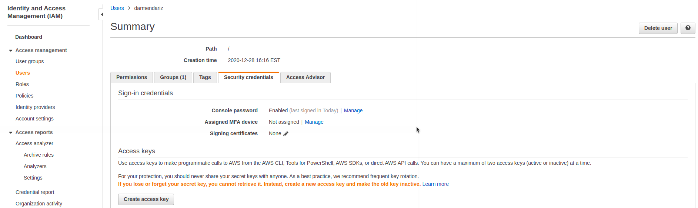

# AWS CLI

To access the AWS CLI you need an access key ID (this is like your username) and and a secret acess key (this is like your password). These can be found in IAM in the "Security credentials" tab.

Once you have your access key ID and your secret access key, type `aws configure` and you will be prompted to enter them.
