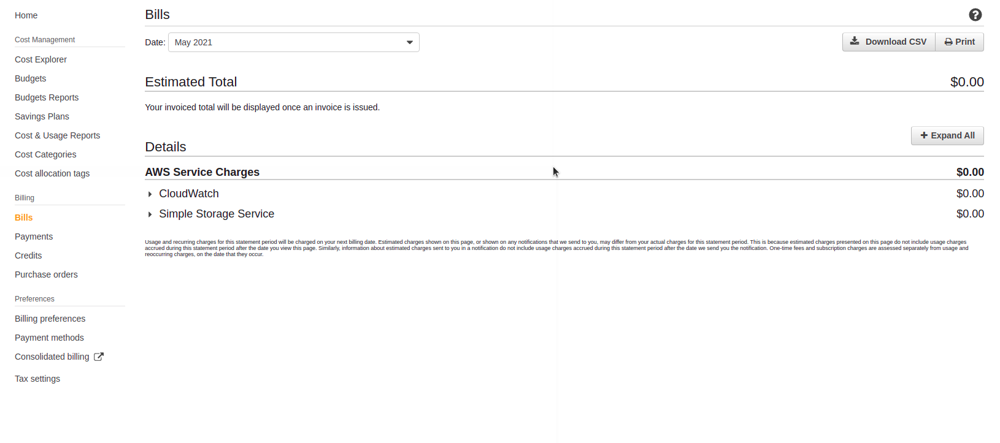
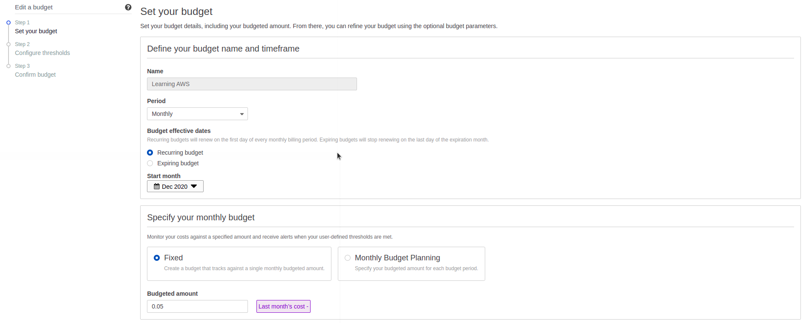
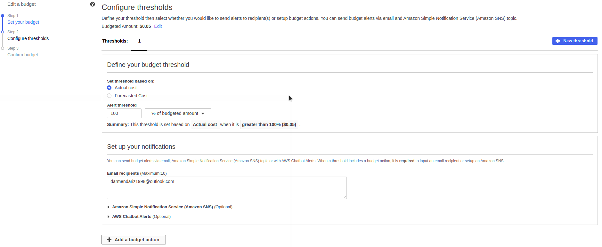

# Budgets

You can check on what you spent money by going to the Billing service. Then go to the "Bills" tab. You will find a report like the one below.

## Cost budgets

To start learning AWS, we can start by creating a Cost budget. Go to the "Budgets" tab of the Billing service and click on "Create budget". There you will be able to set up a budget like this:

After setting up your budget, you can set up thresholds to receive alerts.

