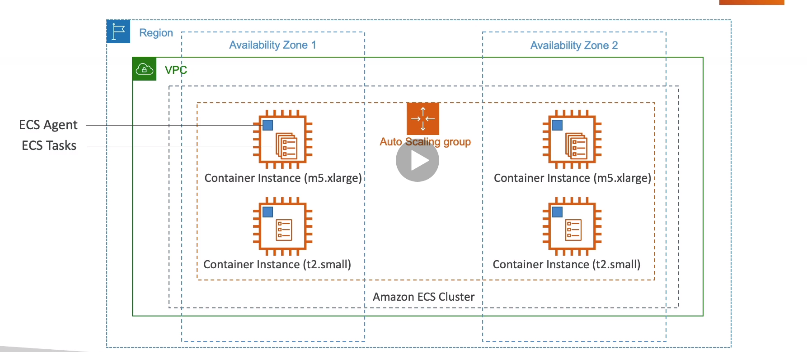
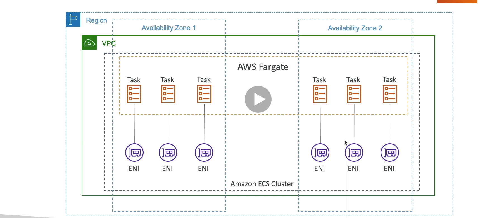
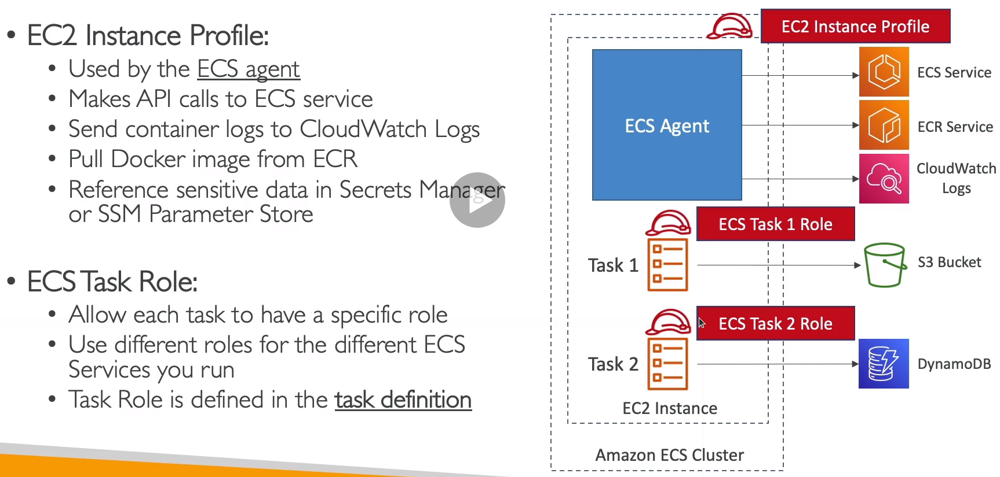
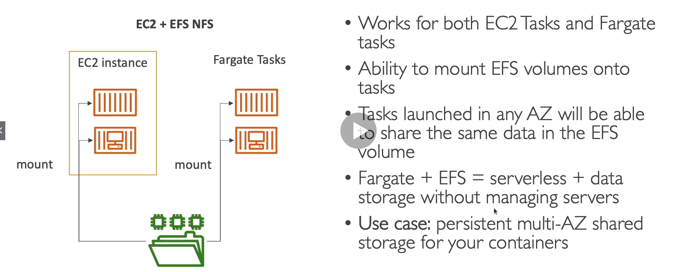
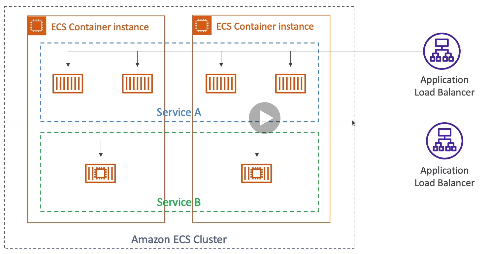
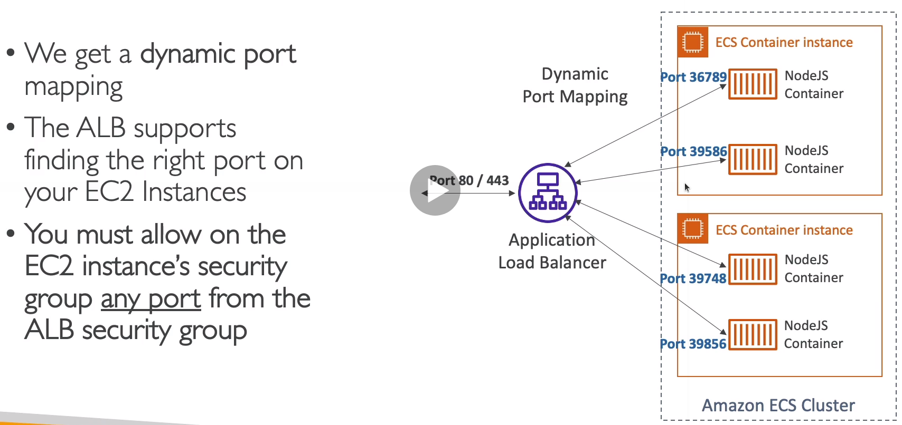
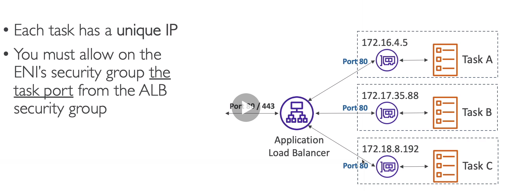
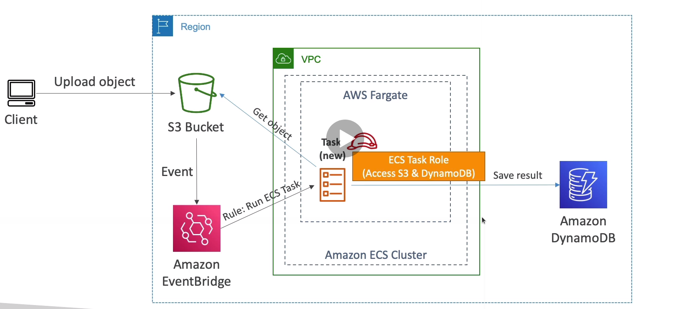

# ECS

* Launch Docker containers on AWS
* You must provision and maintain the infrastructure (EC2 instances)
* AWS takes care of starting/stopping containers
* Has integrations with the ALB

## Fargate

* Launch Docker containers on AWS
* You do not provision the infrastructure (no EC2 instances to manage)
* AWS just runs containers for you based on the CPU/RAM you need

## IAM Roles for ECS Tasks

## ECS Data Volumes - EFS File Systems

## ECS Services and Tasks

## Load Balancing for EC2 Launch Type

## Load Balancing for Fargate

## ECS tasks invoked by Event Bridge

