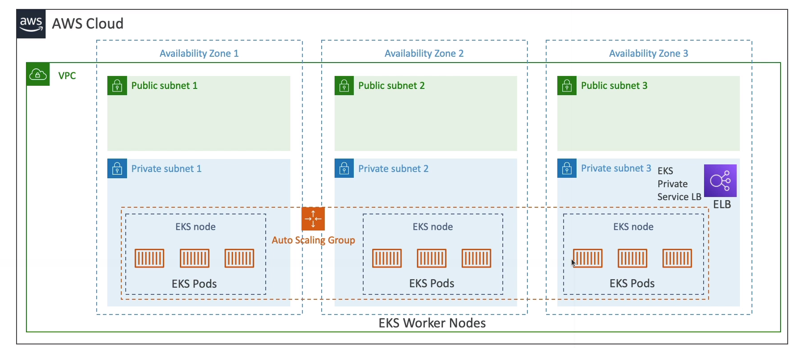

# EKS

* It is a way to launch managed Kubernetes clusters on AWS
* Kubernetes is an open source system for automatic deployment, scaling and management of containerized (usually Docker) application
* It's an alternative to ECS, similar goal but different API
* EKS supports EC2 if you want to deploy worker nodes or Fargate to deploy serverless containers
* Kubernetes is cloud-agnostic

