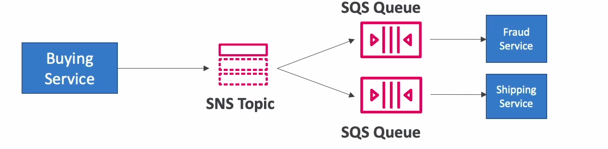

# SNS + SQS: Fan Out

* Push once in SNS, receive in all SQS queues that are subscribers
* Fully decoupled, no data loss
* SQS allows for: data persistance, delayed processing and retries of work
* Ability to add more SQS subscribers over time
* Make sure your SQS queue access **policy** allows for SNS to write

## Application: S3 Events to multiple queues

* For the same combination of: event type and prefix you can only have one S3 event rule
* If you want to send the same S3 event to many SQS queues, use fan out pattern

## SNS - FIFO Topic

* Similar features as SQS FIFO:
  * Ordering by Message Group ID (all messages in the same group are ordered)
  * Deduplication using a Deduplication ID or Content Based Deduplication
* **Can only have SQS FIFO queues as subscribers**
* Limited throughput (same throughput as SQS FIFO)

## Message filtering

* JSON policy used to filter messages sent to SNS topic's subscriptions
* If a subscription doesn't have a filter policy, it receives every message
