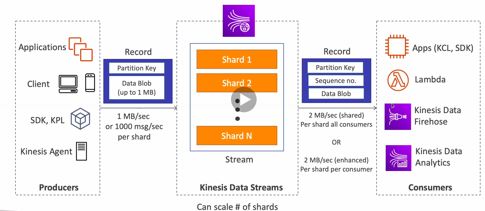
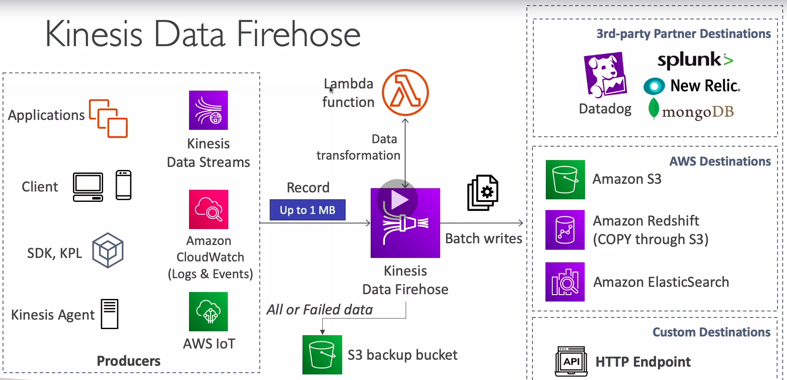
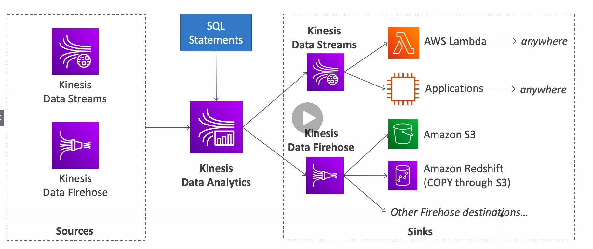

# Kinesis

* Makes it easy to **collect**, **process** and **analyze** streaming data in real time
* Ingest real time data such as: App logs, metrics, website clickstreams, IoT telemetry data...
* **Kinesis Data Streams**: capture, process, and store data streams
* **Kinesis Data Firehose**: load data streams into AWS data stores
* **Kinesis Data Analytics**: analyze data streams with SQL or Apache Flink
* **Kinesis Video Streams**: capture, process and store video streams

## Kinesis Data Streams

* Billing is per shard provisioned
* Retention between 1 day to 365 days
* Ability to reprocess data
* Once data is inserted in Kinesis, it can't be deleted
* Data that shares the same partition goes to the same shard
* Producers: AWS SDK, Kinesis Producer Library (KPL), Kinesis Agent
* Consumers:
  * Write your own: Kinesis Client Library (KCL), AWS SDK
  * Managed: AWS Lambda, Kinesis Data Firehose, Kinesis Data Analytics

## Kinesis Data Firehose

* Fully Managed Service, no administration, automatic scaling, serverless
* Pay for data going through Firehose
* Near Real Time
  * 60 seconds latency minimum for non full batches
  * Or minimum 32MB of data at a time
* Supports many data formats, conversions, transformations, compression
* Supports custom data transformations using AWS Lambda
* Can send failed or all data to a backup S3 bucket

## Kinesis Data Analytics (SQL application)

* Perform real-time analytics on Kinesis Streams using SQL
* Fully managed, no servers to provision
* Automatic scaling
* Real-time analytics
* Pay for actual consumption rate
* Can create streams out of the real-time queries
