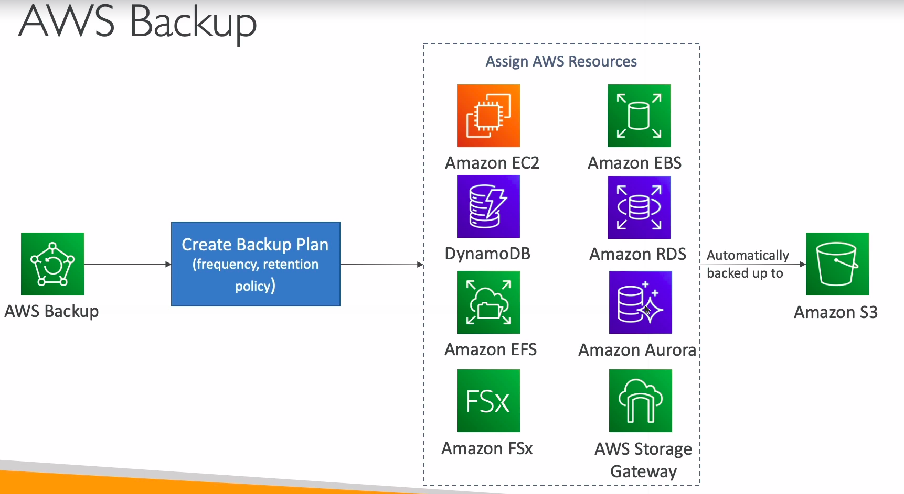

# AWS Backup

* Fully managed service
* Centrally manage and automate backups across AWS services
* No need to create custom scripts and manual processes
* Supported services
  * Amazon FSx
  * Amazon EFS
  * Amazon DynamoDB
  * Amazon EC2
  * Amazon EBS
  * Amazon RDS
  * Amazon Aurora
  * AWS Storage Gateway
* Supports cross-region backups
* Supports cross-account backups
* Supports PITR for supported services
* On-Demand and Scheduled backups
* Tag-based backup policies
* You create backup policies known as Backup Plans
  * Backup frequency
  * Backup window
  * Transition to Cold Storage
  * Retention Period
  

