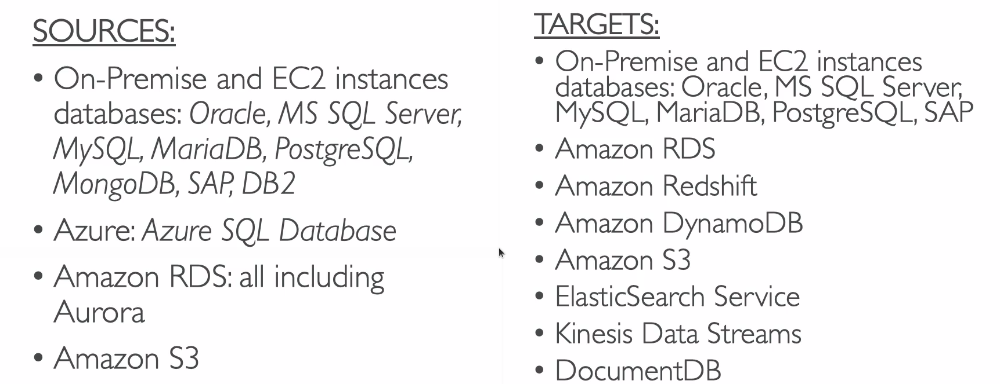
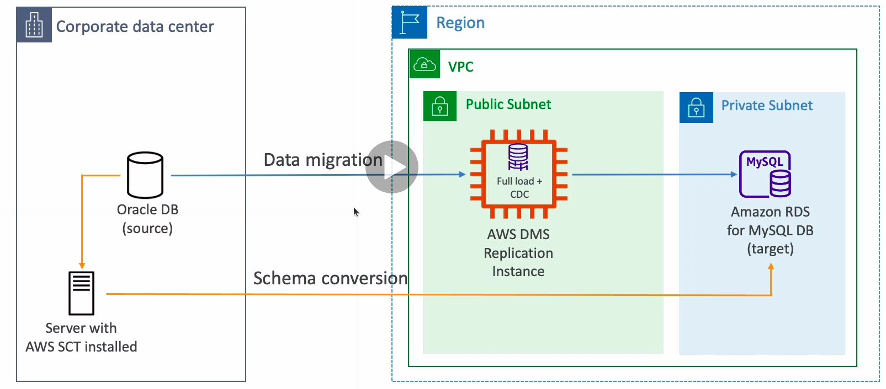

# Database Migration Service

* Quickly and securely migrate databases to AWS, resilient, self healing
* The source database remains available during the migration
* Supports:
  * Homogeneous migrations (e.g. Oracle to Oracle)
  * Heterogeneous migrations (e.g. Microsoft SQL Server to Aurora)
* Continuous Data Replication using CDC
* You must create an EC2 instance to perform the replication tasks

## DMS Sources and Targets

## AWS Schema Conversion Tool

* Convert your database's schema from one engine to another
* You do not need to use SCT if you are migrating the same DB engine

## Continuous Replication

