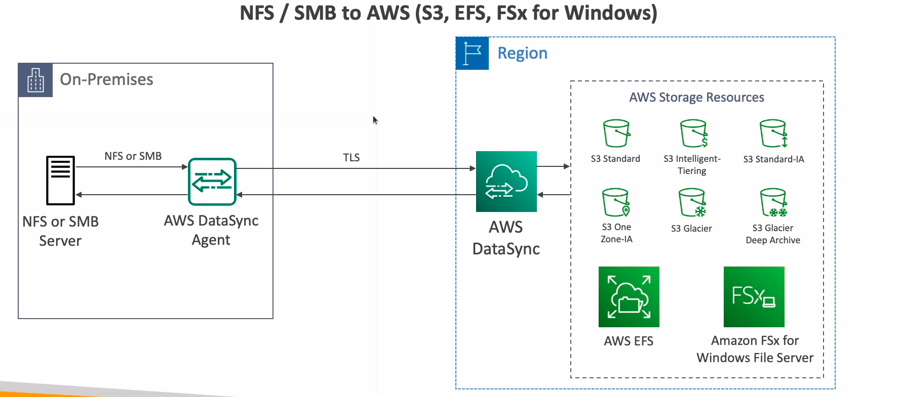
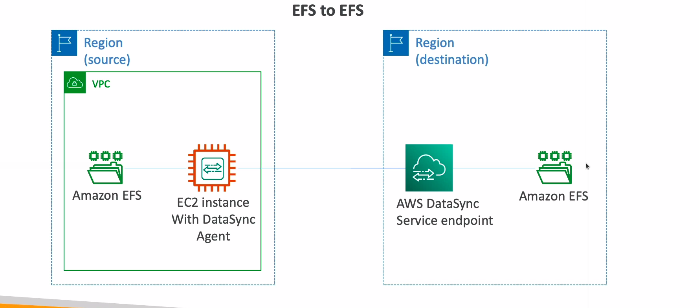

# DataSync

* Move large amount of data from on-premise to AWS
* Can synchronize to: Amazon S3 (any storage classes), Amazon EFS, Amazon FSx for Windows
* Move data from your NAS or file system via NFS or SMB
* Replication tasks can be scheduled hourly, daily, weekly
* Leverage the DataSync agent to connect to your systems
* Can setup a bandwidth limit

