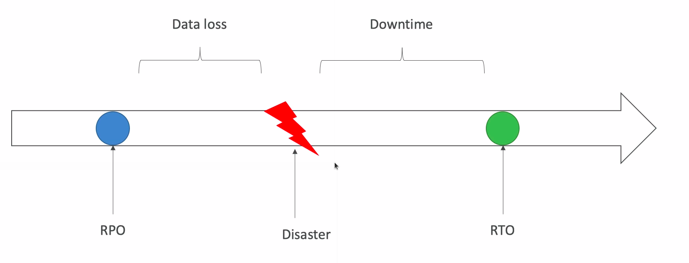

# Disaster Recovery

* Any event that has a negative impact on a company's business continuity or finances is a disaster
* Disaster recovery is about preparing for and recovering from a disaster
* What kind of disaster recovery?
  * On-premise => On-premise: traditional DR, and very expensive
  * On-premise => AWS Cloud: hybrid recovery
  * AWS Cloud Region A => AWS Cloud Region B
* Need to define two terms:
  * RPO: Recovery Point Objective
  * RTO: Recovery Time Objective

## RPO and RTO

## Disaster Recovery Strategies

### Backup and Restore

* High RPO

### Pilot Light

* A small version of the app is always running in the cloud
* Useful for the critical core (pilot light)
* Very similar to backup and restore
* Faster than backup and restore as critical systems are already up

### Warm Standby

* Full system is up and running but at minimum size
* Upon disaster, we can scale to production load

### Multi Site/Hot Site Approach

* Very low RTO but very expensive
* Full production scale is running AWS and On-Premise

### All AWS Multi Region
