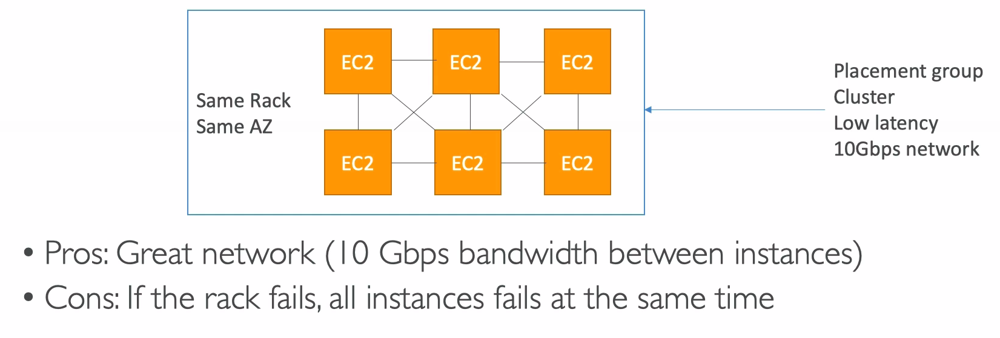
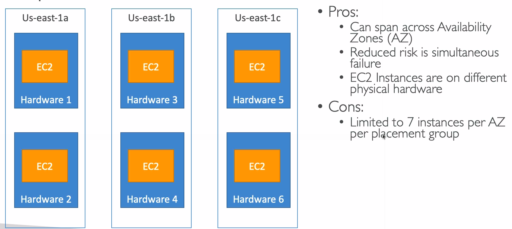
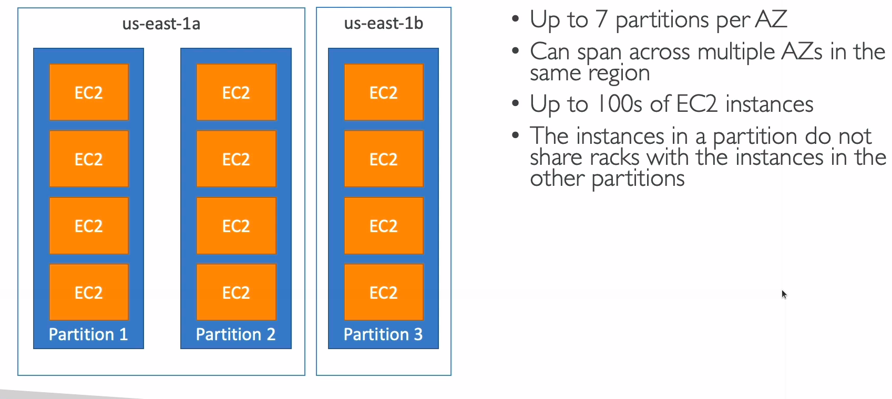

# Placement Groups

* Sometimes you want control over the EC2 instance placement strategy
* That strategy can be defined using placement groups
* When you create a placement group, you specify one of the following strategies for the group:
  * **Cluster**: clusters instances into a low latency group in a single AZ
  * **Spread**: spreads instances across underlying hardware (max 7 instances per group per AZ). Useful for critical applications
  * **Partition**: spreads instances across many different partitions (which rely on different sets of racks) within an AZ. Scales to 100s of EC2 instances per group. Great for applications involving **Hadoop**, **Cassandra**, **Kafka**, etc. EC2 instances get access to the partition information as metadata

## Cluster

## Spread

## Partition

