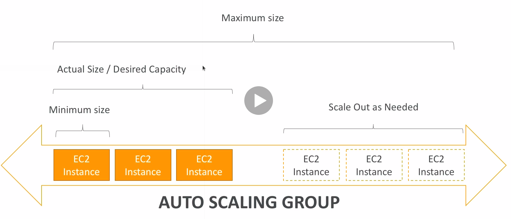
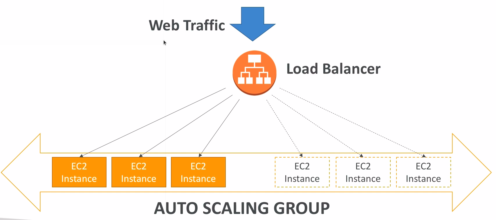

# Auto Scaling Groups

* In real-life, the load on your websites and application can change
* In the cloud, you can create and get rid of servers very quickly
* The goal of an ASG is to:
  * Scale out (add EC2 instances) to match an increased load
  * Scale in (remove EC2 instances) to match a decreased load
  * Ensure we have a minimum and a maximum number of machines running
  * Automatically register new instances to a load balancer

## Attributes

* A launch configuration
  * AMI + Instance Type
  * EC2 User Data
  * EBS Volumes
  * Security Groups
  * SSH Key Pair
* Min Size / Max Size / Initial Capacity
* Network + Subnets Information
* Load Balancer Information
* Scaling Policies

## Alarms

* It is possible to scale an ASG based on CloudWatch alarms
* An alarm monitors a metric (such as average CPU)
* **Metrics are computed for the overall ASG instances**

## Rules

* It is now to possible to define better auto scaling rules that are directly managed by EC2
  * Target Average CPU Usage
  * Number of requests on the ELB per instance
  * Average Network In
  * Average Network Out
* These rules are easier to set up and can make more sense

## Custom Metric

* We can auto scale based on a custom metric (e.g. number of connected users)
* Send Custom metric from application on EC2 to CloudWatch (PutMetric API)
* Create CloudWatch alarm to react to low/high values
* Use the CloudWatch alarm as the scaling policy for ASG

## Other things to know

* ASGs use Launch configurations or Launch templates
* To update an ASG, you must provide a new launch configuration/launch template
* IAM roles attached to an ASG will get assigned to EC2 instances
* ASG are free. You pay for the underlying resources being launched
* Having instances under an ASG means that if they get terminated for whatever reason, the ASG will automatically create new ones as a replacement
