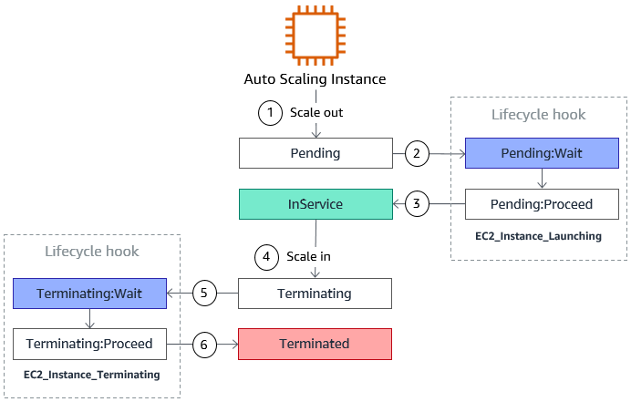

# Termination Policy

* Find the AZ which has the most number of instances
* If there are multiple instances in the AZ to choose from, delete the one with the oldest launch configuration

## Lifecycle Hooks

* By default as soon as an instance is launched in an ASG it is in service
* You have the ability to perform extra steps before the instance goes in service (Pending state)

