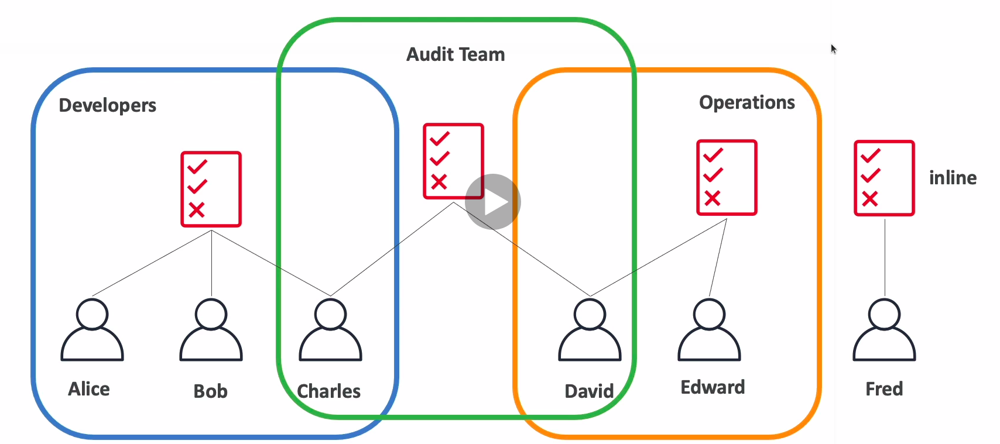
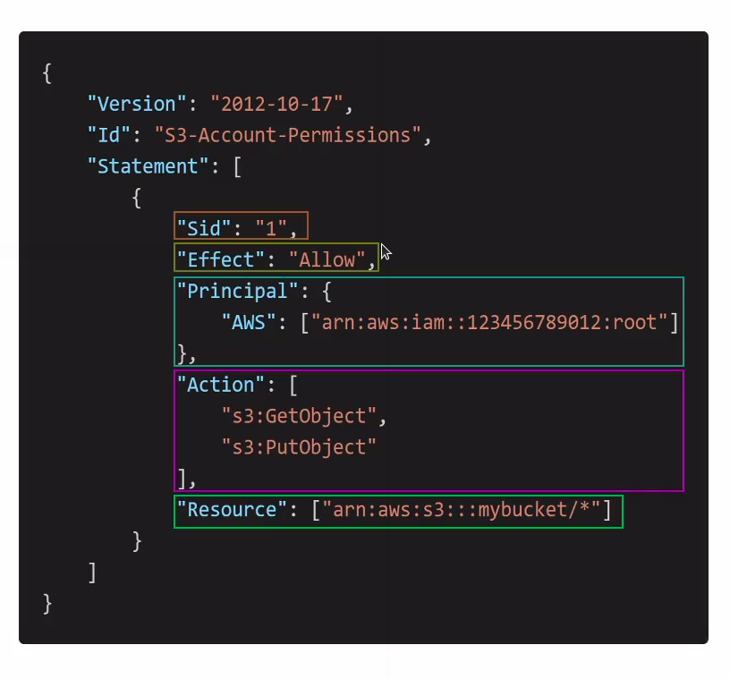

# IAM Policies inheritance

## Policies structure

* Consists of
  * Version: policy language version, always include "2012-10-17"
  * Id: an identifier for the policy
  * Statement: one or more individual statements (required)
* Statements consists of
  * Sid: an identifier for the statement
  * Effect: wether the statement allows or denies access (Allow, Deny)
  * Principal: account/user/role to which this policy applied to
  * Action: list of actions this policy allows or denies
  * Resource: list of resources to which the actions applied to
  * Condition: conditions for when tis policy is in effect (optional)

