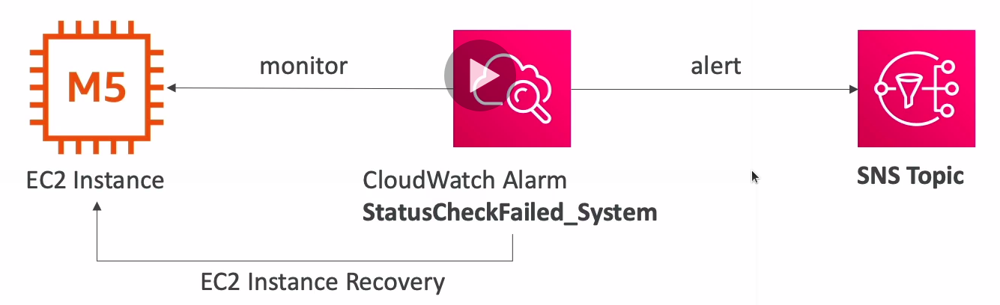

# EC2 Instance Recovery

* Status Check:
  * Instance status: check the EC2 VM
  * System status: check the underlying hardware
* Recovery: same private, public, elastic IP, metadata, placement group

