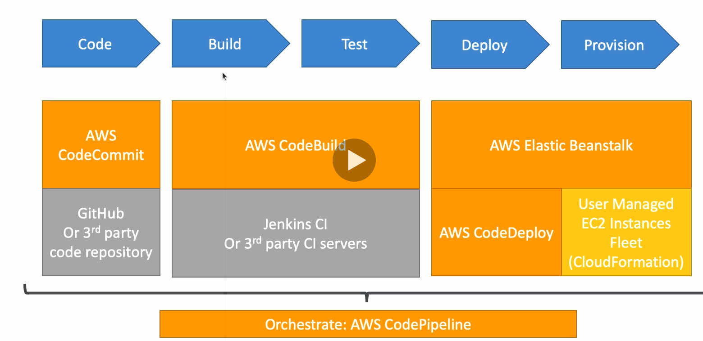

# CI/CD

## Continuous integration

* Developers push the code to a code repo (CodeCommit)
* A testing/build server checks the code as soon as it's pushed (CodeBuild)
* The developer gets feedback about the tests and checks that have passed/failed
* Find bugs early, fix bugs
* Deliver faster as the code is tested
* Deploy often
* Happier devs, as they are unblocked

## Continuous delivery

* Ensure that the software can be released reliably whenever needed
* Ensures deployments happen often and are quick
* Shift away from "one release every 3 months" to "5 releases a day"
* That usually means automated deployment (CodeDeploy)

