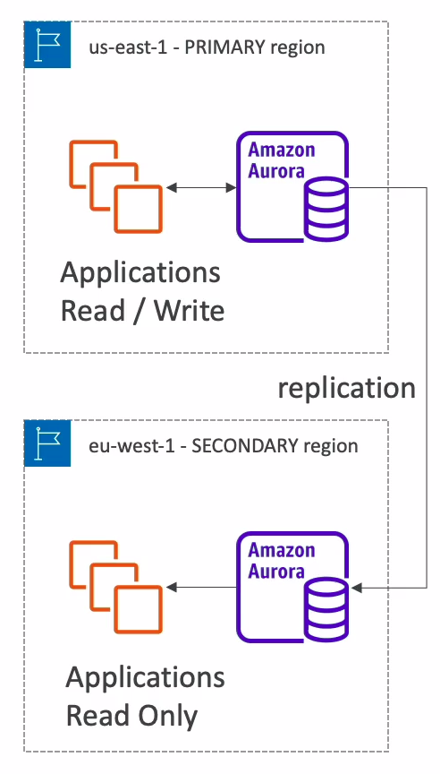

# Aurora

* Compatible with Postgres and MySQL
* Aurora is AWS cloud optimized and claims 5x performance improvement over MySQL on RDS, over 3x the performance of Postgres on RDS
* Aurora storage automatically grows in increments of 10GB up to 64TB
* Can have **15 replicas** while MySQL has 5 and the replication process is faster (sub 10 ms replica lag)
* Failover in Aurora is instantaneous

## High availability and read scaling

* 6 copies of your data across 3 AZ
  * 4 copies out of 6 needed for writes
  * 3 copies out of 6 need for reads
  * Self healing with peer-to-peer replication
  * Storage is striped across 100s of volumes
* One Aurora instance takes writes (master)
* Automated failover for master in less than 30 seconds
* Master + up to 15 Aurora Read Replicas serve reads
* Support for Cross Region Replication

## Aurora DB Cluster

* Writer endpoint (pointing to the master)
* Reader endpoint (connection load balancing)

## Features of Aurora

* Automatic fail-over
* Backup and Recovery
* Isolation and security
* Industry compliance
* Push-button scaling
* Automated Patching with Zero Downtime
* Advanced Monitoring
* Routine Maintenance
* Backtrack: restore data at any point of time without using backups

## Security

* Similar to RDS because uses the same engine
* Encryption at rest using KMS
* Automated backups, snapshots and replicas are also encrypted
* Encryption in flight using SSL (same process as MySQL or Postgres)
* Possibility to authenticate using IAM token (same method as RDS)
* You can't SSH
* You are responsible for protecting the instance with security groups

## Advanced concepts

### Aurora Replicas - Auto Scaling

### Custom Endpoints

* Define a subset of Aurora instances as a Custom Endpoint
* Example: run analytical queries on specific replicas
* The reader endpoint is generally not used after defining custom endpoints

### Serverless

* Automated database instantiation and auto scaling based on actual usage
* Good for infrequent, intermittent or unpredictable workloads
* No capacity planning needed
* Pay per second

### Multi-Master

* In case you want immediate failover for write node (HA)
* Every node does read and write vs promoting a read replica as the new master

### Global Aurora

* Aurora Cross Region Read Replicas:
  * Useful for disaster recovery
  * Simple to put in place
* Aurora Global Database (recommended):
  * 1 primary region (read and write)
  * Up to 5 secondary (read-only) regions, replication lag is less than 1 second
  * Up to 16 read replicas per secondary region
  * Helps for decreasing latency
  * Promoting to another region (for disaster recovery) has an RTO of < 1 minute

### Aurora Machine Learning

* Enables you to add ML-based predictions to your applications via SQL
* Simple, optimized, and secure integration between Aurora and AWS ML services
* Supported services:
  * Amazon SageMaker
  * Amazon Comprehend
