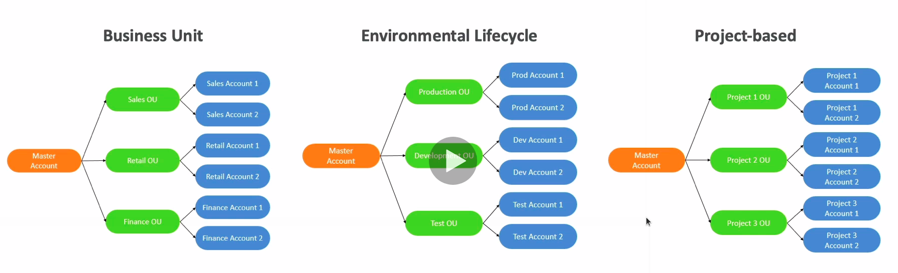
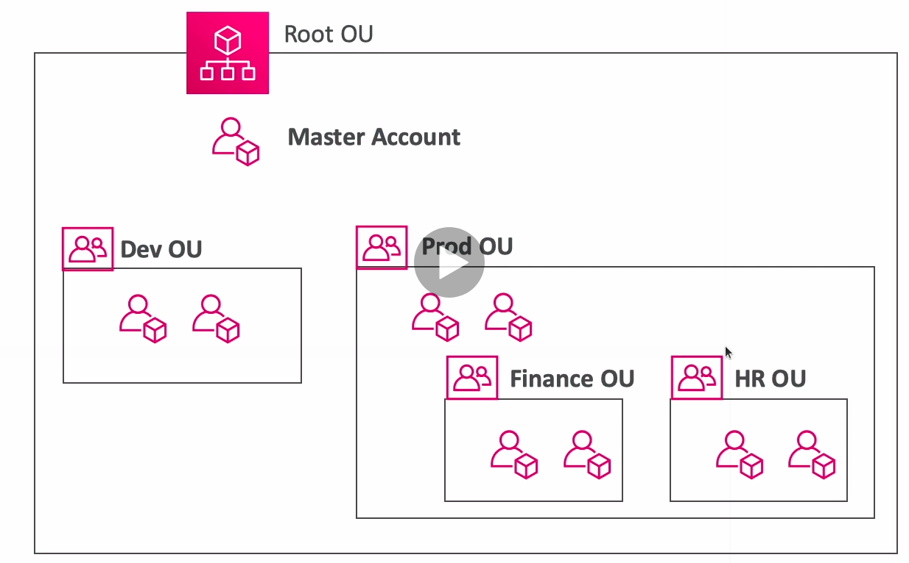
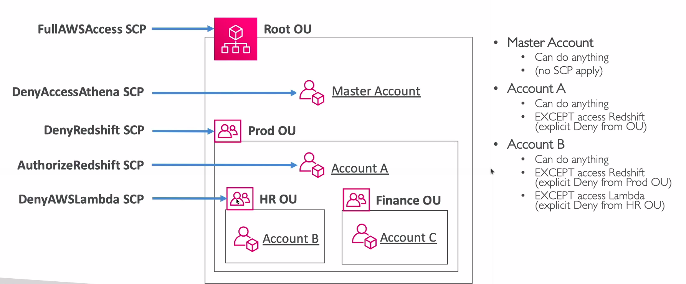

# Organizations

* Global service
* Allows to manage multiple AWS accounts
* The main account is the master account
* Other accounts are member accounts
* Member accounts can only be part of one organization
* Consolidated billing across all accounts
* Pricing benefits from aggregated usage
* API is available to automate AWS account creation

## Multi Account Strategies

* Create accounts per department, per cost center, per dev/test/prod based on regulatory restrictions, for better resource isolation, to have separate per-account service limits, isolated accounts for logging
* Multi Account vs One Account Multi VPC
* Use tagging standards for billing purposes
* Enable CloudTrail on all accounts, send logs to central S3 account
* Send CloudWatch Logs to central logging account
* Establish Cross Account Roles for Admin purposes

## Organizational Units (OU)

## AWS Organization

## Service Control Policies (SCP)

* Whitelist or blacklist IAM actions
* Applied at the OU or Account level
* Does not apply to the master account
* SCP is applied to all the users and roles of the account, including root
* The SCP does not affect service-linked roles
  * Service-linked roles enable other AWS services to integrate with AWS Organizations and can't be restricted by SCPs
* SCP must have an explicit Allow (does not allow anything by default)
* Use cases:
  * Restrict access to certain services (for example: can't use EMR)
  * Enforce PCI compliance by explicitly disabling services

