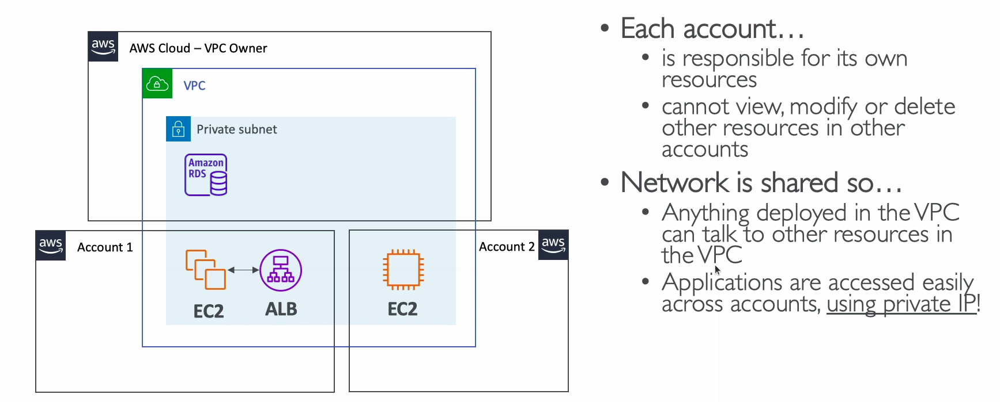

# Resource Access Manager

* Share AWS resources that you own with other AWS accounts
* Share with any account or within your organization
* Avoid resource duplication
* VPC Subnets:
  * Allow to have all the resources launched in the same subnets
  * Must be from the same AWS organization
  * Cannot share security groups and default VPC
  * Participants can manage their own resources in there
  * Participants can't view, modify, delete resources that belong to other participants or the owner
* AWS Transit Gateway
* Route53 Resolver Rules
* License Manager Configurations

