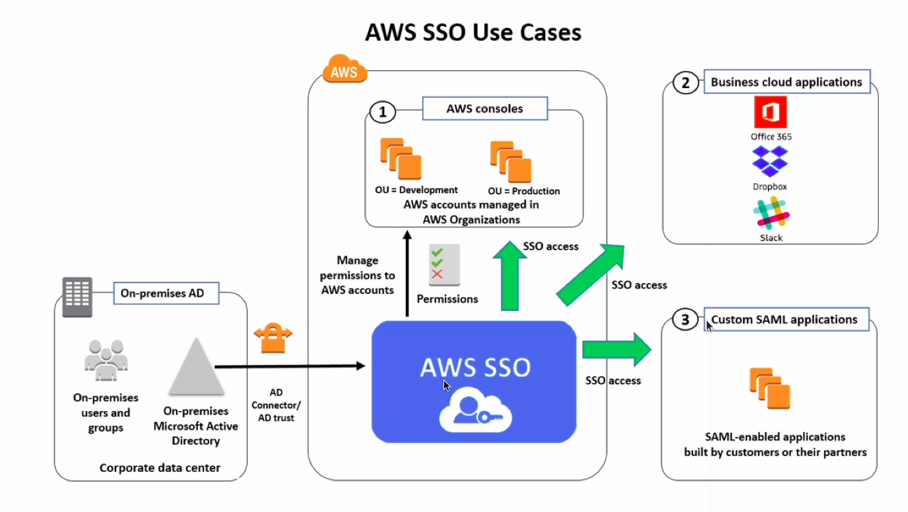

# SSO

* Centrally manage SSO to access multiple accounts and 3rd party business applications
* Integrated with AWS Organizations
* Supports SAML 2.0 markup
* Integration with on-premise Active Directory
* Centralized permission management
* Centralized auditing with CloudTrail

