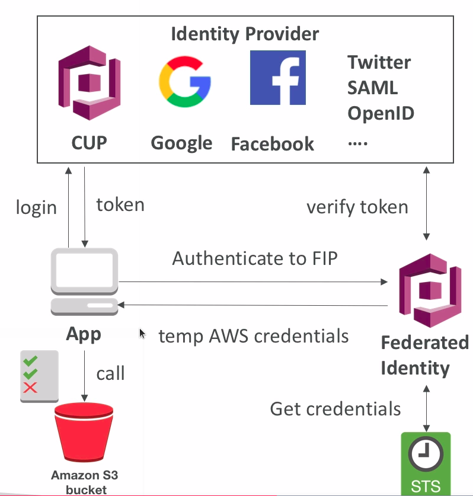

# AWS Cognito

* Used when we want to give our users an identity so that they can interact with our app
* Cognito User Pools:
  * Sign in functionality for app users
  * Integrate with API Gateway
* Cognito Identity Pools (Federated Identity):
  * Provide AWS credentials to users so they can access AWS resources directly
  * Integrate with Cognito User Pools as an identity provider
* Cognito Sync:
  * Synchronize data from device to Cognito
  * May be deprecated and replaced by **AppSync**

## Cognito User Pools (CUP)

* Create a serverless database of user for your mobile apps
* Simple login: username (or email)/password combination
* Possibility to verify emails/phone numbers and add MFA
* Can enable _Federated Identities_ (Facebook, Google, SAML)
* Sends back a JWT
* Can be integrated with API Gateway for authentication

## Federated Identity Pools

* Goal:
  * Provide direct access to AWS Resources from the Client Side
* How:
  * Log in to federated identity provider - or remain anonymous
  * Get temporary AWS credentials back from the Federated Identity Pool
  * These credentials come with a pre-defined IAM Policy stating their permissions
* Example:
  * Provide (temporary) access to write to S3 bucket using Facebook Login

