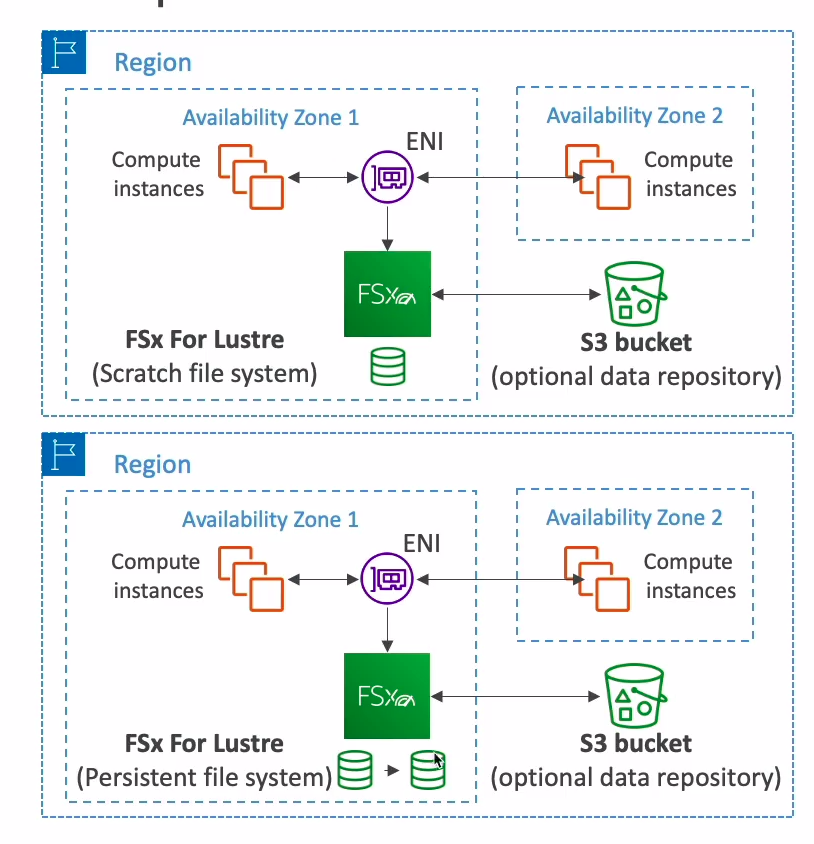

# Amazon FSx for Windows (File Server)

* EFS is a shared POSIX system for Linux systems
* FSx for Windows is a fully managed Windows file system share drive
* Supports SMB protocol and Windows NTFS
* Microsoft AD integration, ACLs user quotas
* Built on SSD, scale up to 10s of GB/s, millions of IOPS, 100s PB of data
* Can be accessed from your on-premise infrastructure
* Can be configured to be Multi-AZ (high availability)
* Data is backed-up daily to S3

## Amazon FSx for Lustre

* Lustre is a type of parallel distributed file system for large-scale computing
* The name Lustre is derived from "Linux" and "cluster"
* Machine Learning, High Performance Computing (HPC), etc.
* Video Processing, Financial Modeling, Electronic Design Automation
* Scales up to 100s GB/s, millions of IOPS, sub-ms latencies
* Seamless integration with S3
  * Can read S3 as a file system (through FSx for Lustre)
  * Can write the output of computations back to S3 (through FSx for Lustre)
* Can be used from on-premise servers

## FSx File System Deployment Options

* Scratch File System
  * Temporary storage
  * Data is not replicated
  * High burst (6x faster, 200MBps per TiB)
  * Usage: short-term processing, optimize costs
* Persisten File System
  * Long-term storage
  * Data is replicated within same AZ
  * Replace failed files within minutes
  * Usage: long-term processing, sensitive data
  

