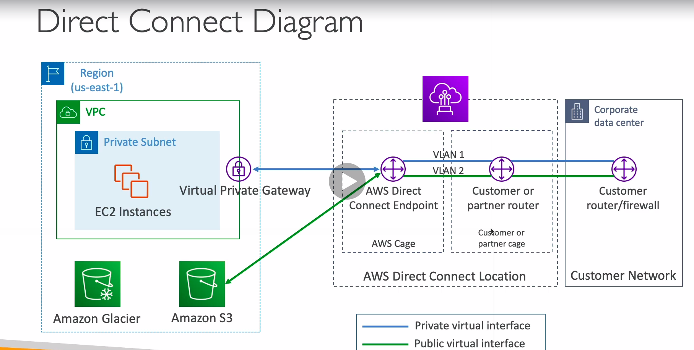
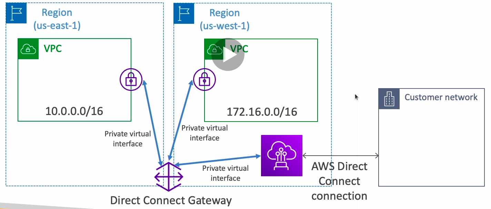
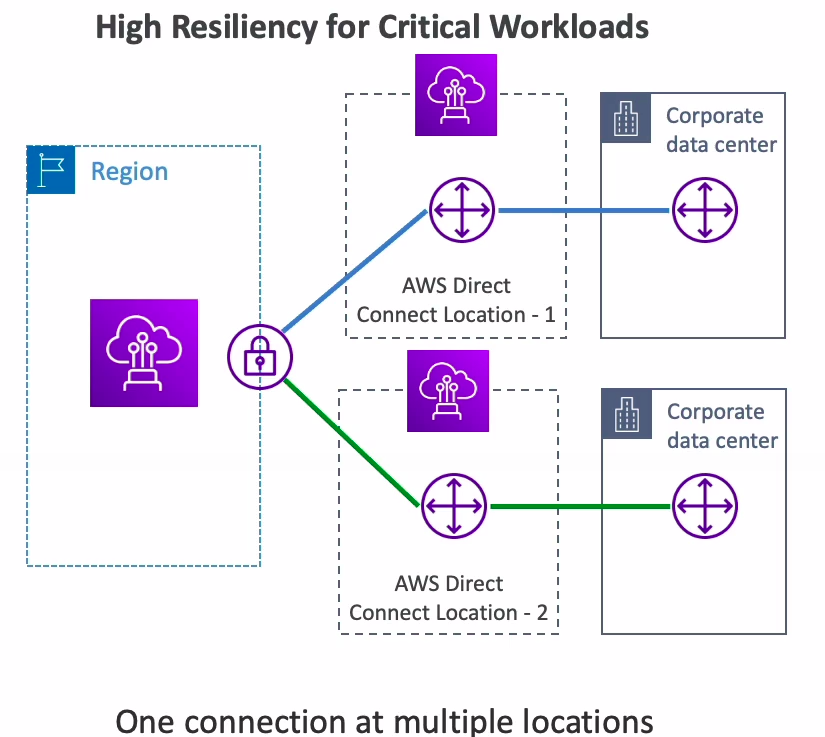
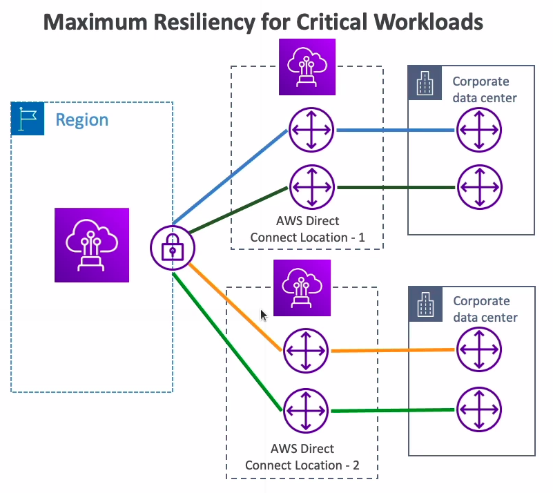

# Direct Connect (DX)

* Provides a dedicated private connection from a remote network to your VPC
* Dedicated connection must be setup between your DC and AWS Direct Connect locations
* You need to setup a Virtual Private Gateway on your VPC
* Access public resources (S3) and private (EC2) on same connection
* Use cases:
  * Increase bandwidth throughput - working with large data sets - lower cost
  * More consistent network experience - applications using real-time data feeds
  * Hybrid environments
* Supports IPv4 and IPv6

## Direct Connect Gateway

* If you want to setup a Direct Connect to one or more VPC in many different regions (same account), you must use a Direct Connect Gateway

## Connection types

* Dedicated connections: 1Gbps and 10 Gbps capacity
  * Physical ethernet port dedicated to a customer
  * Request made to AWS first, then completed by AWS Direct Connect Partners
* Hosted Connections: 50Mbps, 500Mbps, 10Gbps
  * Connection requests are made via AWS Direct Connect Partners
  * Capacity can be added or removed on demand
  * 1, 2, 5, 10 Gbps available at select AWS Direct Connect Partners
* Lead times are often longer than 1 month to establish a new connection

## Encryption

* Data in transit is not encrypted but is private
* AWS Direct Connect + VPN provides an IPsec-encrypted private connection
* Good for an extra level of security, but slightly more complex to put in place

## Resiliency

* High resiliency for critical workloads

* Maximum resiliency for critical workloads

