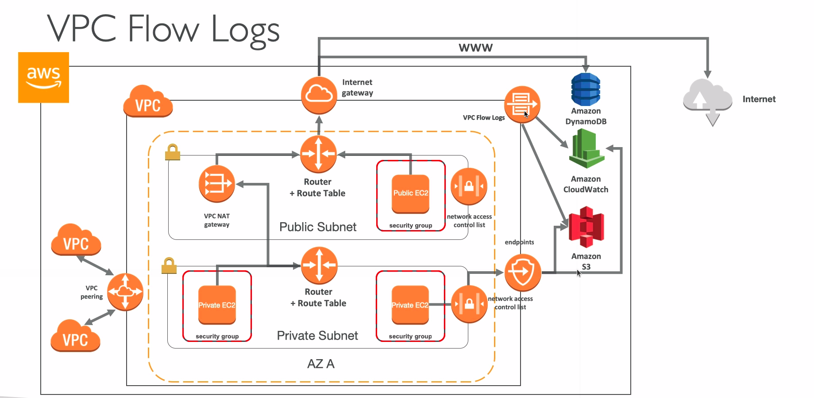

# Flow Logs

* Capture information about IP traffic going into your interfaces:
  * VPC Flow Logs
  * Subnet Flow Logs
  * Elastic Network Interface Flow Logs
* Helps to monitor and troubleshoot connectivity issues
* Flow logs data can go to S3/CloudWatch Logs
* Captures network information from AWS managed interfaces too: ELB, RDS, ElastiCache, Redshift, WorkSpaces

## Syntax

* <version>
* <account-id>
* <interface-id>
* <srcaddr>
* <dstaddr>
* <srcport>
* <dstport>
* <protocol>
* <packets>
* <bytes>
* <start>
* <end>
* <action>
* <log-status>

* Srcaddr, dstaddr help identify problematic IP
* Srcport, dstport help identify problematic ports
* Action: success or failures of the request due to Security Group/NACL
* Can be used for analytics on usage patterns, or malicious behavior
* Query VPC flow logs using Athena on S3 or CloudWatch Logs Insights
