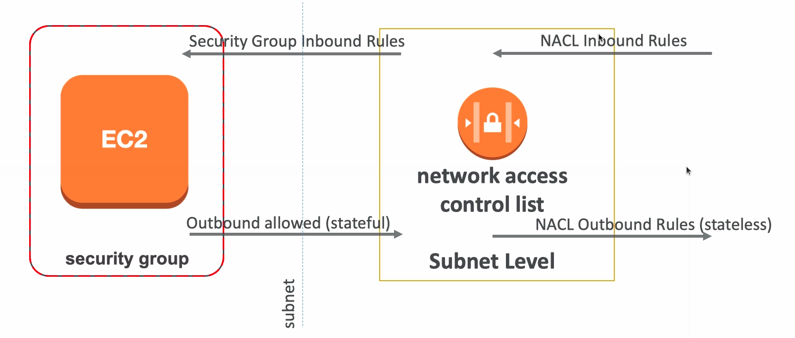
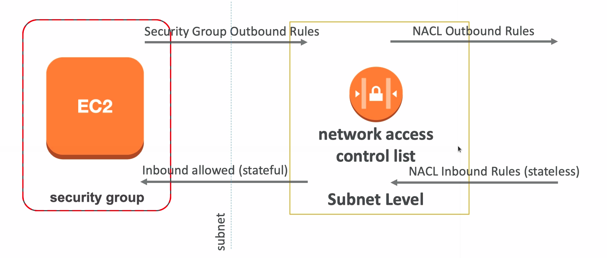

# Network ACLs and Security Group Incoming Request

* NACL are like a firewall which control traffic from and to subnet
* Default NACL allows everything outbound and everything inbound
* One NACL per Subnet, new Subnets are assigned the Default NACL
* Define NACL rules:
  * Rules have a number (1-32766) and higher precedence with a lower number
  * Last rule is an asterisk (*) and denies a request in case of no rule match
  * AWS recommends adding rules by increment of 100
* Newly created NACL will deny everything
* NACL are a great way of blocking a specific IP at the subnet level
