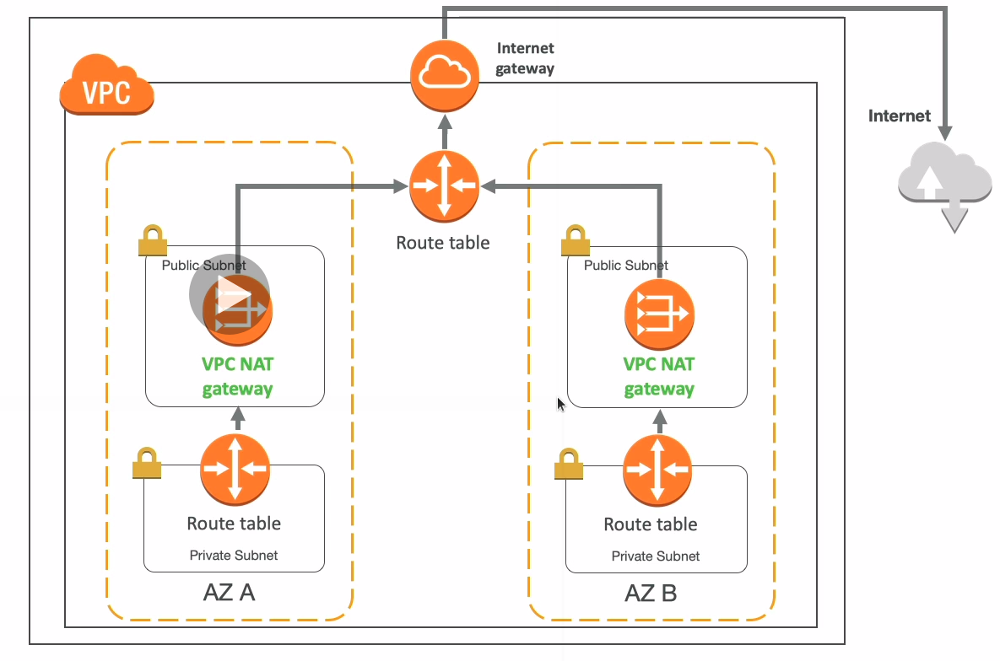

# NAT Gateway

* AWS managed NAT, higher bandwidth, better availability, no admin
* Pay by the hour for usage and bandwidth
* NAT is created in a specific AZ, uses an EIP
* Cannot be used by an instance in that subnet (only from other subnets)
* Requires an IGW (Private subnet => NAT => IGW)
* 5Gbps of bandwidth with automatic scaling up to 45Gbps
* No security group to manage/required

* NAT Gateway is resilient within a single AZ
* Must create multiple NAT Gateway in multiple AZ for fault-tolerance
* There is no cross AZ failover needed because if an AZ goes down it doesn't need NAT

