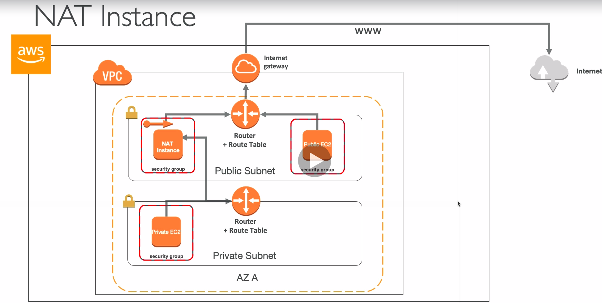

# NAT Instances - Network Address Translation

* Allows instances in the private subnets to connect to the internet
* Must be launched in a public subnet
* Must disable EC2 flag: Source/Destination Check
* Must have Elastic IP attached to it
* Route table must be configured to route traffic from private subnets to NAT instance

## Comments

* Amazon Linux AMI pre-configured are available
* Not HA/resilient setup out of the box
* Would need to create ASG in multi AZ + resilient user-data script
* Internet traffic bandwidth depends on EC2 instance performance
