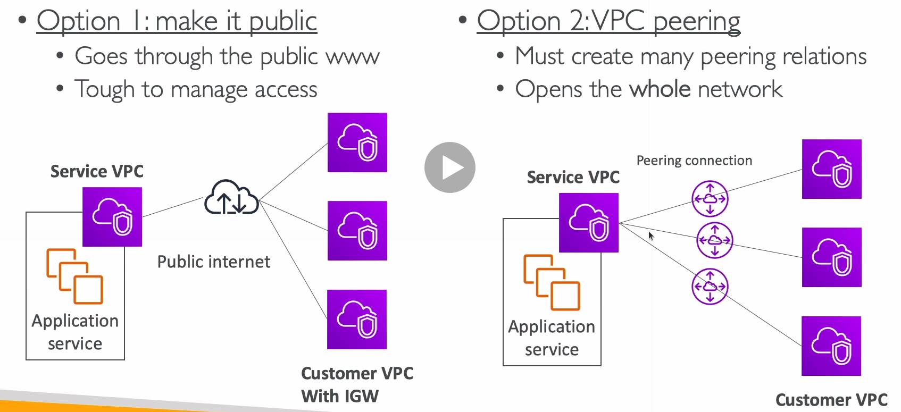
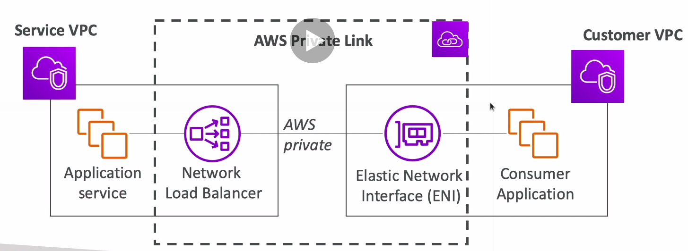

# AWS Private Link

* With AWS Private Link (VPC Endpoint Services):
  * Most secure and scalable way to expose a service to 1000s of VPC
  * Does not require VPC peering, internet gateway, NAT, route tables
  * Requires a network load balancer (Service VPC) and ENI (Customer VPC)

