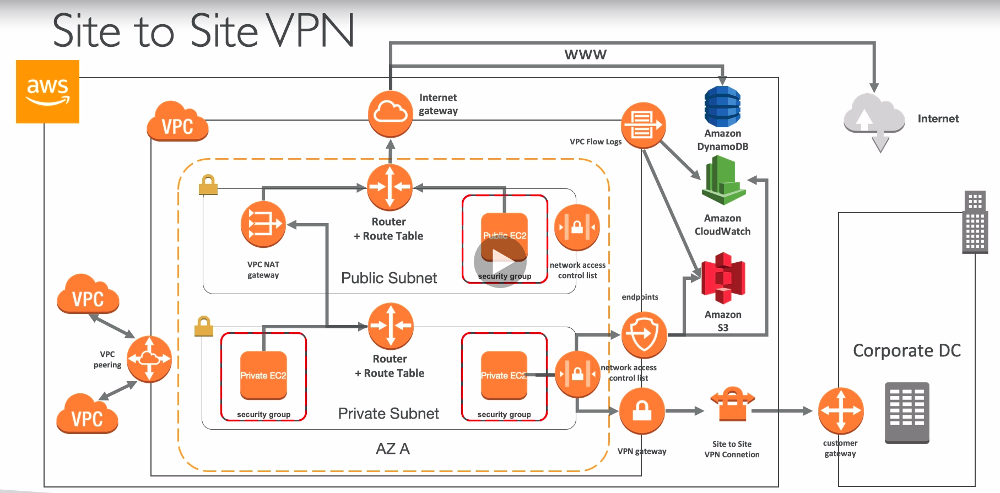

# Site to Site VPN

* Virtual Private Gateway
  * VPN concentrator on the AWS side of the VPN connection
  * VGW is created and attached to the VPC from which you want to create the Site-to-Site VPN connection
  * Possibility to customize the ASN
* Customer Gateway
  * Software application or physicial device on customer side of the VPN connection
  * IP Address:
    * Use static, internet-routable IP address for your customer gateway device
    * If behind a CGW behind NAT (with NAT-T), use the public IP address of the NAT
