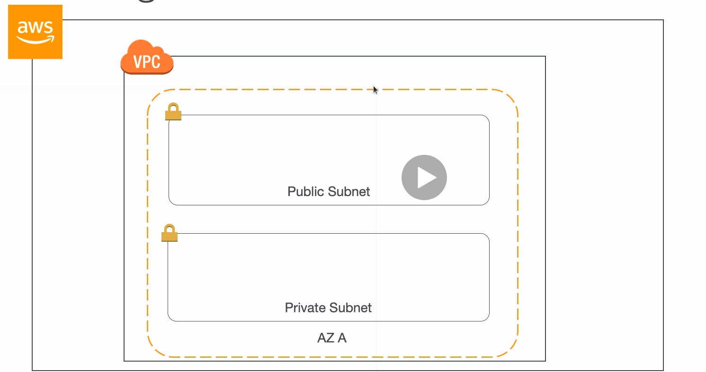

# Subnet

* AWS reserves 5 IPs address (first 4 and last 1 IP address) in each subnet
* These 5 IPs are not available for use and cannot be assigned to an instance
* Example: if CIDR block 10.0.0.0/24, reserved IP are:
  * 10.0.0.0: network address
  * 10.0.0.1: reserved by AWS for the VPC router
  * 10.0.0.2: reserved by AWS for mapping to Amazon-provided DNS
  * 10.0.0.3: reserved by AWS for future use
  * 10.0.0.255: network broadcast address. AWS does not support broadcast in a VPC, therefore the address is reserved
  