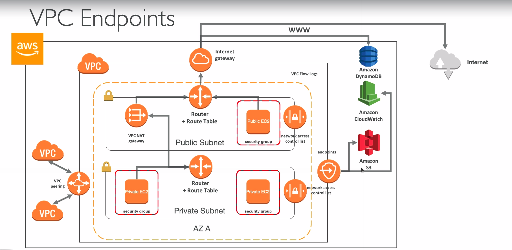

# VPC Endpoints

* Endpoints allow you to connect to AWS services using a private network instead of the public www network
* They scale horizontally and are redundant
* They remove the need of IGW, NAT, etc... to access AWS services
* Interface: provisions an ENI (private IP address) as an entry point (must attach security group) - most AWS services
* Gateway: provisions a target and must be used in a route table - S3 and DynamoDB
* In case of issues:
  * Check DNS setting resolution in your VPC
  * Check Route Tables
  