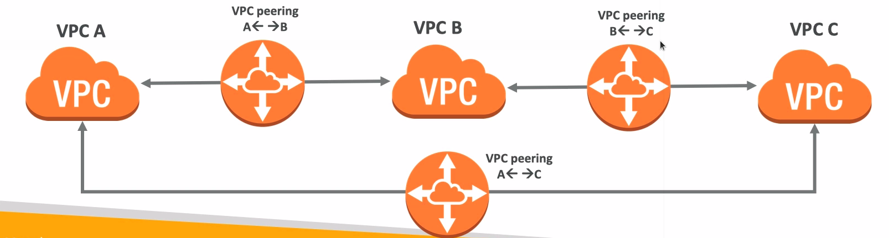

# VPC Peering

* Connect two VPC, privately using AWS network
* Make them behave as if they were in the same network
* Must not have overlapping CIDR
* VPC Peering connection is not transitive (must be established for each VPC that need to communicate with one another)
* You can do VPC peering with another AWS account
* You must update route tables in each VPC's subnets to ensure instances can communicate

## Good to know

* VPC peering can work inter-region, cross-account
* You can reference a security group of a peered VPC (works cross account)
